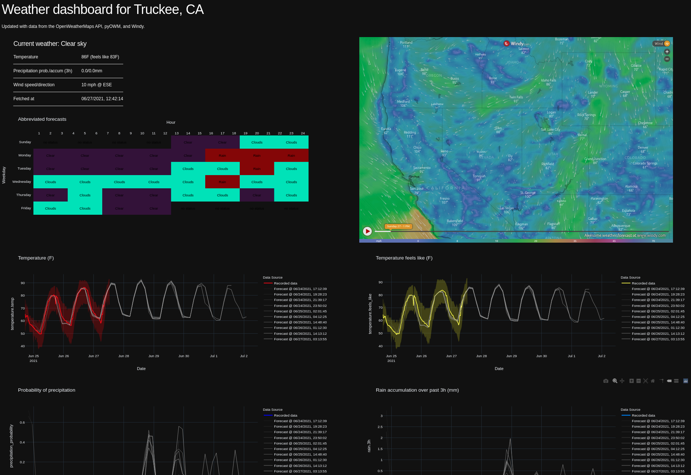

# `wdash`
a dumb-simple weather dashboard built from OpenWeatherMaps APi, MongoDB, Windy, and Plotly Dash


## Picture Demo


## Video Demo


## Install

`wdash` consists of two scripts, neither of which needs to be installed as a python module in order to run:

- `daemon.py`: Pulls data from OpenWeatherMaps, stores it in a mongodb.
- `app.py`: The plotly dash app which will display the dashboard.


### 1. Install mongodb for your platform, if you intend to run the database locally.

You can find instructions for how to do so here: https://docs.mongodb.com/manual/administration/install-community/

Next, ensure mongodb is running. You can check by trying to connect to your mongodb with the `mongo` shell command.

### 2. Install python requirements

Navigate to the `wdash` directory and run

```
pip install -r requirements.txt
```

### 3. Configure `wdash`


All the variables needed to configure `wdash` are in `config.yml`. 

#### `LAT` and `LON`
Any latitude and longitude in the world.

#### `DB_HOST`
The host of your mongodb instance, e.g., `localhost`

#### `DB_PORT`
The port of your mongodb instance, e.g., 27017

#### `DB_NAME`
The name of the mongodb database you'd like to use or create to hold your wdash data, e.g., `wdash`

#### `INTERVAL`
The interval to update (gather current weathers and forecasts), in seconds. The default `1800` corresponds to  every 30 minutes.

#### `PORT`
The port you'd like the `wdash` interface to run on.

#### `API_KEY`
Your OpenWeatherMaps API key. Only the free-tier API key is required for full functionality. You'll need to create a free account to get an API key.

#### `WINDY_EMBED`
The embeddable url for your windy map, which you can obtain from [Windy](https://www.windy.com/-Embed-widget-on-page/widgets?39.339,-120.173,5)


## Running `wdash`

Simply run


```
source run.sh
```

In the `wdash` directory for the daemon and app to run in the background. All output will be logged to `log.txt` in the `wdash` directory.

